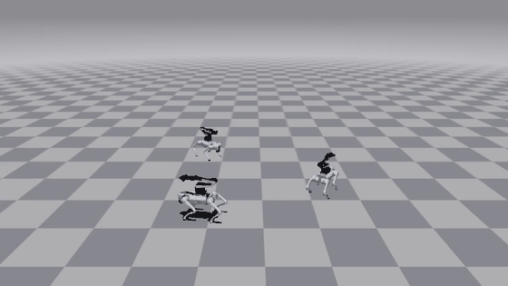

# UniLab 足式移动操作

[English](README.md)

## 任务概览

这是一个面向 Go2 四足机器人和 Airbot 六轴机械臂组合的强化学习任务仓库。
它提供完整的 Manip-Loco 训练配置、机器人场景、IK 诊断工具，以及 PPO 和
HIM-PPO 两种训练方案。

任务在 UniLab 训练框架中注册为 `Go2ArmManipLoco`，支持 MuJoCo 与 Motrix
后端；机器人 XML、网格和纹理随仓库提供，训练前不需要从 Hugging Face 下载
机器人数据。

## 能力与展示

### 能力

| 能力 | 说明 |
| --- | --- |
| 足式移动操作 | 在 Go2 行走控制中加入 Airbot 末端目标跟踪。 |
| PPO 训练 | 提供 MuJoCo 和 Motrix 训练配置。 |
| HIM-PPO 训练 | 提供 actor 观测历史与 privileged critic 输入。 |
| IK 诊断 | 查看末端目标、检查 Jacobian、标定姿态并对比数值方案。 |
| 本地机器人资产 | 内置 Go2 + Airbot 场景、网格和纹理，可离线加载。 |
| 策略回放与导出 | 按训练日志选择 checkpoint，回放视频并导出 HIM-PPO 策略。 |

### 展示

MuJoCo 上的 HIM-PPO 回放:速度指令跟踪(蓝色箭头),IK 驱动的机械臂跟踪采样的
末端目标(红色球)。



## 复现流程

### 安装

```bash
git clone https://github.com/unilabsim/legged-manipulation_unilab.git
cd legged-manipulation_unilab
uv sync --extra mujoco --extra motrix
```

如需导出 HIM-PPO 策略，再增加 `--extra export`。安装后可先准备本地资产
缓存：

```bash
uv run legged-assets
```

### 演示

无需自己训练,直接回放内置 checkpoint:

```bash
uv run legged-demo maniploco-ppo   # MuJoCo 上的 PPO
uv run legged-demo maniploco-him   # MuJoCo 上的 HIM-PPO
```

checkpoint 随仓库一起发布(`assets/checkpoints/`),并附带训练时的
`run_config.json`,回放会自动恢复训练时的任务阶段。可以继续追加
`legged-eval` 的 override,例如
`uv run legged-demo maniploco-ppo training.play_steps=400`。

### 训练

内置训练配置默认均为 3000 次策略更新。可按后端和算法选择：

```bash
uv run legged-train --algo ppo --sim mujoco training.no_play=true
uv run legged-train --algo ppo --sim motrix training.no_play=true
uv run legged-train --algo him_ppo --sim mujoco training.no_play=true
```

训练 run 会分别写入 `logs/ppo-mujoco`、`logs/ppo-motrix` 或
`logs/him-mujoco`。只有需要换位置时才覆盖 `training.log_root`。

使用 `--cfg` 查看组合后的完整配置。短训验证可覆盖更新次数，例如：

```bash
uv run legged-train --algo ppo --sim mujoco algo.max_iterations=10 training.no_play=true
```

### 评估与导出

把 `--run` 指向训练日志父目录、单个 run 目录或 `model_*.pt` 文件；
默认选择最新 checkpoint：

```bash
uv run legged-eval --algo ppo --sim mujoco --run logs/ppo-mujoco/Go2ArmManipLoco
uv run legged-eval --algo ppo --sim motrix --run logs/ppo-motrix/Go2ArmManipLoco
uv run legged-eval --algo him_ppo --sim mujoco --run logs/him-mujoco/Go2ArmManipLoco
```

用 `--checkpoint 100` 选择指定 checkpoint。无显示环境时添加
`MUJOCO_GL=egl`。安装 export extra 后，HIM-PPO 评估可加 `--export` 导出
策略。

### IK 检查

```bash
uv run legged-ik
uv run legged-diagnose-ik
uv run legged-calibrate --target 0.30 0.0 0.25
uv run legged-benchmark-jacobian
```

查看器需要图形显示；诊断、标定和 benchmark 使用内置 MuJoCo 场景。

## 文档

- [文档索引](docs/README.md)
- [任务与复现](docs/zh-CN/task.md)
- [HIM-PPO 使用](docs/zh-CN/him-ppo.md)
- [调参指南](docs/zh-CN/tuning.md)
- [IK 诊断](docs/zh-CN/ik-diagnostics.md)
- [维护者架构说明](docs/zh-CN/architecture.md)

## 许可证

本仓库主体采用 Apache-2.0，同时包含 BSD-3-Clause 组件和上游机器人资产
声明；详见 [LICENSE](LICENSE)、[LICENSES](LICENSES) 与
[NOTICE](NOTICE.md)。
